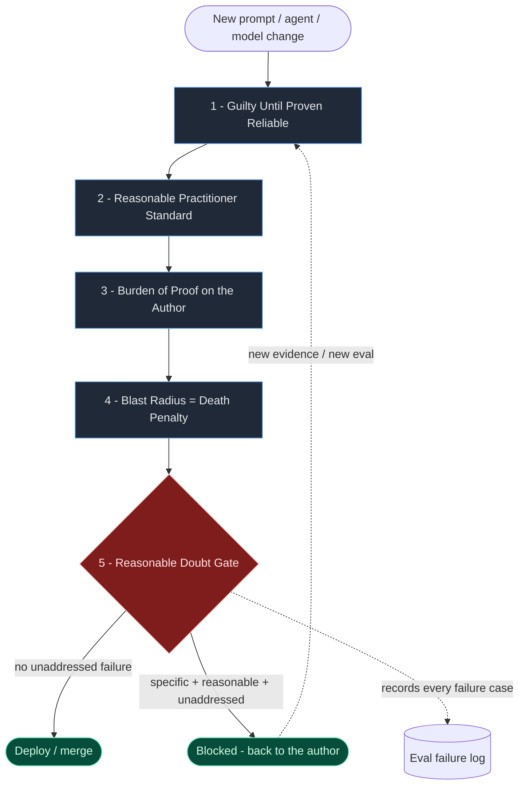
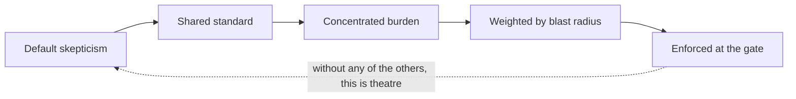

# Reasonable Doubt for AI

**A reasonable-doubt approach to prompts, agents, and LLM generation.**

> *"It is better that ten generations be re-rolled than one autonomous action go unquestioned."*

---

## Why AI needs its own version

Most teams ship prompts the way they used to ship architecture: by vibe. Someone tries a prompt three times in a playground, it "feels right," and it goes to production. The result is the same failure mode software engineering has spent decades naming — optimism bias, diffuse accountability, ignored dissent — only now the system is **non-deterministic** and the inputs are **adversarial**.

This document applies the *reasonable doubt* discipline to AI work. It stands on its own. You don't need to read anything else in this repo to use it.

Two things make AI fundamentally different from a normal piece of code, and the framework here takes both seriously:

- **Non-determinism.** A prompt that works "most of the time" is not a fact, it is a distribution. Evidence has to be statistical, not anecdotal.
- **Adversarial input.** Failures aren't just accidents waiting to happen, they are inputs someone is actively crafting. Evals must include attacks, not just happy paths.

---

## The theory in one picture



ASCII version:

```
   ┌────────────────────────────┐
   │ New prompt / agent / model │
   └─────────────┬──────────────┘
                 ▼
   ┌────────────────────────────┐    optimism bias
   │ 1. Guilty until proven     │◄── attacked here
   │    reliable                │
   └─────────────┬──────────────┘
                 ▼
   ┌────────────────────────────┐    authority + preference bias
   │ 2. Reasonable practitioner │◄── neutralized here
   │    standard                │
   └─────────────┬──────────────┘
                 ▼
   ┌────────────────────────────┐    diffuse accountability
   │ 3. Burden of proof on      │◄── concentrated on the
   │    the author              │    prompt author
   └─────────────┬──────────────┘
                 ▼
   ┌────────────────────────────┐    underestimated blast radius
   │ 4. Blast radius =          │◄── weighted by autonomy +
   │    death penalty           │    side effects
   └─────────────┬──────────────┘
                 ▼
        ╔════════════════╗
        ║  5. DOUBT GATE ║──── specific + reasonable + unaddressed ──► BLOCK
        ╚════════╤═══════╝
                 │ clear
                 ▼
            DEPLOY / SHIP
```

---

## The five principles at a glance

| # | Principle | Protects against | Deep dive |
|---|-----------|------------------|-----------|
| 1 | Guilty Until Proven Reliable | Vibe-driven evaluation | [ai-principles/01-guilty-until-proven-reliable.md](ai-principles/01-guilty-until-proven-reliable.md) |
| 2 | The Reasonable Practitioner Standard | Authority + preference bias | [ai-principles/02-reasonable-practitioner-standard.md](ai-principles/02-reasonable-practitioner-standard.md) |
| 3 | Burden of Proof on the Author | Nobody owning the eval | [ai-principles/03-burden-of-proof.md](ai-principles/03-burden-of-proof.md) |
| 4 | Blast Radius as the Death Penalty | Treating an agent like a chat reply | [ai-principles/04-blast-radius.md](ai-principles/04-blast-radius.md) |
| 5 | Reasonable Doubt as a Deploy Gate | A known failure case shipping anyway | [ai-principles/05-doubt-gate.md](ai-principles/05-doubt-gate.md) |

Plus two AI-native concepts that thread through all five:

- **Variance threshold** — pass rates are distributions, not booleans
- **Adversarial-by-default** — every eval set includes attacks (prompt injection, jailbreaks, malformed input)



---

## Visual companion

The [`ai-diagrams/`](./ai-diagrams) folder contains visual companions to the theory:

- [`flow.md`](ai-diagrams/flow.md) — end-to-end prompt-to-deploy flow
- [`blast-radius.md`](ai-diagrams/blast-radius.md) — the autonomy axis (chat reply → autonomous agent with tools)
- [`evidence-tiers.md`](ai-diagrams/evidence-tiers.md) — how AI evidence is weighted (anecdote → eval set → adversarial eval)
- [`variance.md`](ai-diagrams/variance.md) — non-determinism, variance bands, and pass-rate thresholds
- [`doubt-gate.md`](ai-diagrams/doubt-gate.md) — what blocks vs. what passes

---

## When to use it

Apply proportionally to the **blast radius** of the AI action, not the size of the prompt change:

- A one-shot answer in a personal chat — vibes are fine
- A system prompt baked into a product used by many people — full discipline
- An agent that can take actions with side effects (send email, run code, move money) — maximum discipline; novelty + autonomy + irreversibility is the danger zone

A trivial prompt tweak should take minutes. A new agent loop with tool access should take days.

---

## The shift

The deepest effect, same as anywhere this approach is applied, is cultural rather than procedural. The team stops defending prompts as extensions of taste and starts evaluating them as cases that either hold up to an eval set — including adversarial cases — or don't.

It also creates a shared vocabulary for dissent. Instead of *"I don't think this prompt is safe"* — which invites debate about feelings — the team can say *"I have a specific failure case at line 47 of the red-team set that is unaddressed"* — which invites a fix.

---

*Generate with conviction. Evaluate by default.*
