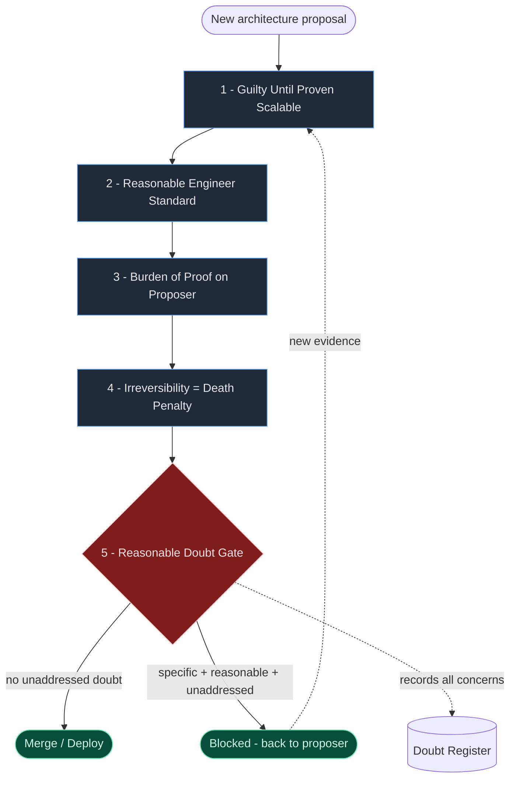
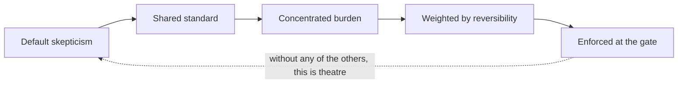

# The Verdict Framework

**A reasonable-doubt approach to architecture decisions.**

> *"It is better that ten flawed decisions be revisited than one irreversible one go unquestioned."*

---

## What this is

Most engineering teams adopt new architecture with implicit optimism. Doubt is something reviewers have to fight for, and decisions get made on social momentum instead of evidentiary strength.

The **Verdict Framework** flips that default. It borrows the strongest principle from criminal law — *reasonable doubt* — and applies it to high-stakes, often irreversible architecture decisions. Every proposal arrives as a case that must be prosecuted: not to find fault, but to rigorously eliminate reasonable doubt before committing.

This repo contains:

- The full framework in [`verdict_framework.md`](./verdict_framework.md) — the canonical source.
- One deep-dive file per principle in [`principles/`](./principles).
- Diagrams that visualize the theory in [`diagrams/`](./diagrams).

---

## The theory in one picture



ASCII version of the same flow, for plain-text contexts:

```
   ┌──────────────────────┐
   │ Architecture proposal│
   └──────────┬───────────┘
              ▼
   ┌──────────────────────┐    optimism bias
   │ 1. Guilty until      │◄── attacked here
   │    proven scalable   │
   └──────────┬───────────┘
              ▼
   ┌──────────────────────┐    authority + preference bias
   │ 2. Reasonable        │◄── neutralized here
   │    engineer standard │
   └──────────┬───────────┘
              ▼
   ┌──────────────────────┐    diffuse accountability
   │ 3. Burden of proof   │◄── concentrated here
   │    on the proposer   │
   └──────────┬───────────┘
              ▼
   ┌──────────────────────┐    underestimated consequence
   │ 4. Irreversibility = │◄── weighted here
   │    death penalty     │
   └──────────┬───────────┘
              ▼
        ╔═════════════╗
        ║  5. DOUBT   ║──── specific + reasonable + unaddressed ──► BLOCK
        ║    GATE     ║
        ╚══════╤══════╝
               │ clear
               ▼
          MERGE / DEPLOY
```

---

## The five principles at a glance

| # | Principle | Protects against | Deep dive |
|---|-----------|------------------|-----------|
| 1 | Guilty Until Proven Scalable | Optimism bias | [principles/01-guilty-until-proven-scalable.md](principles/01-guilty-until-proven-scalable.md) |
| 2 | The Reasonable Engineer Standard | Authority + preference bias | [principles/02-reasonable-engineer-standard.md](principles/02-reasonable-engineer-standard.md) |
| 3 | Burden of Proof on the Proposer | Diffuse accountability | [principles/03-burden-of-proof.md](principles/03-burden-of-proof.md) |
| 4 | Irreversibility as the Death Penalty | Underestimating consequence | [principles/04-irreversibility.md](principles/04-irreversibility.md) |
| 5 | Reasonable Doubt as a Merge/Deploy Gate | Doubt being raised but ignored | [principles/05-doubt-gate.md](principles/05-doubt-gate.md) |

They form a system, not a checklist. The gate (#5) only has teeth if the burden is on the proposer (#3). The burden only works if there is a shared standard (#2). The standard only matters if reversibility (#4) is accounted for. And all of it depends on the default posture of skepticism (#1).



---

## Visual companion

The [`diagrams/`](./diagrams) folder contains visual companions to the theory:

- [`flow.md`](diagrams/flow.md) — end-to-end decision flow
- [`principles-map.md`](diagrams/principles-map.md) — how the five principles interlock
- [`reversibility-spectrum.md`](diagrams/reversibility-spectrum.md) — the death-penalty axis
- [`doubt-gate.md`](diagrams/doubt-gate.md) — what blocks vs. what passes
- [`evidence-tiers.md`](diagrams/evidence-tiers.md) — how evidence is weighted

---

## When to use it

The framework is not for every decision. Apply it proportionally:

- Any decision in the medium-reversibility tier or above
- Any decision that affects more than one team or service
- Any decision where the team has previously had a painful postmortem
- Any decision that introduces a new technology or vendor

Speed and rigor are not opposites. A small reversible decision should take minutes. A large irreversible one should take days.

---

## The shift

The deepest effect of the Verdict Framework is cultural, not procedural. It separates identity from judgment. Engineers stop defending proposals as extensions of their competence and start evaluating them as cases that either hold up to scrutiny or don't.

It also creates a shared vocabulary for dissent. Instead of *"I'm not comfortable with this"* — which invites social negotiation — engineers can say *"I have an unaddressed reasonable doubt"* — which invites evidentiary response.

---

*Commit with conviction. Question by default.*
