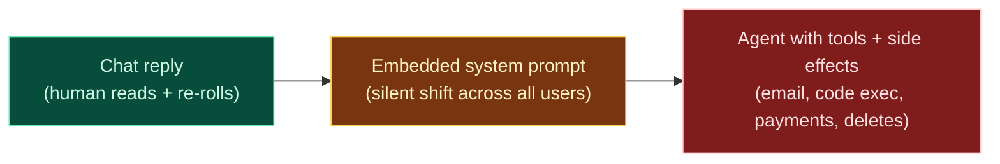
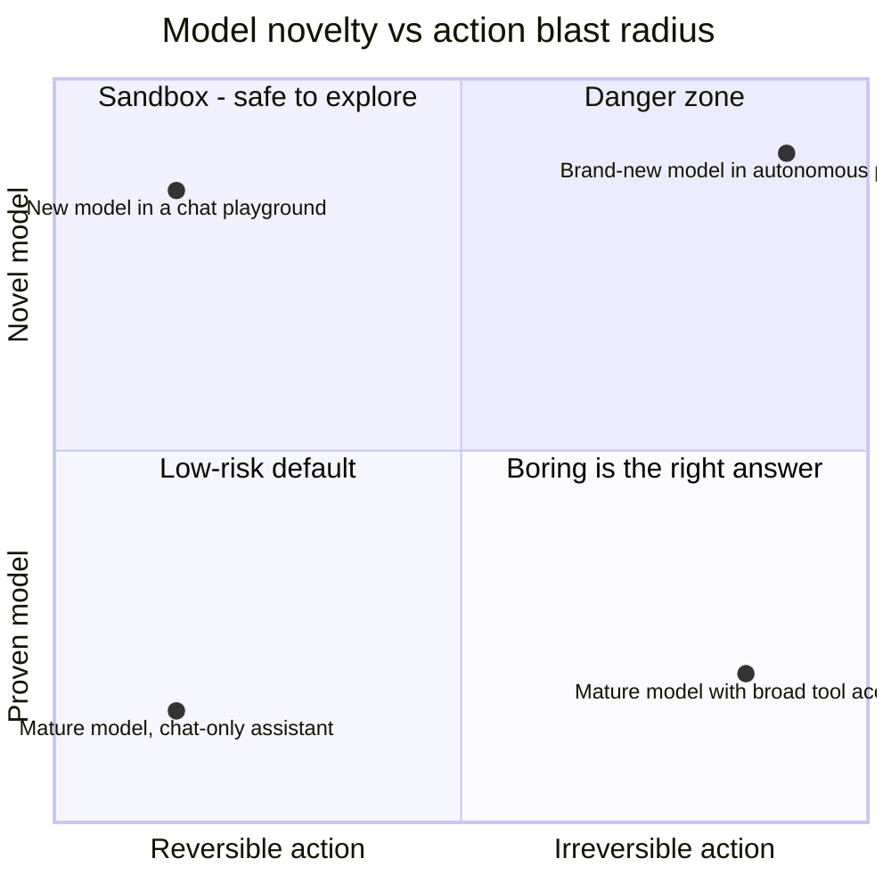

# AI Diagram — Blast radius

The death-penalty axis for AI. Doubt threshold scales with the autonomy of the AI **and** the side effects of its actions.



ASCII view with thresholds:

```
   ◄──── low blast radius                    high blast radius ────►
   ┌───────────────┬─────────────────────┬───────────────────────┐
   │  CHAT REPLY   │  SYSTEM PROMPT      │   AGENT + TOOLS       │
   │  (one-shot)   │  IN PRODUCT         │   + SIDE EFFECTS      │
   ├───────────────┼─────────────────────┼───────────────────────┤
   │ human reads   │ silent behavior     │ sends email, runs     │
   │ + re-rolls    │ shift across all    │ code, moves money,    │
   │               │ users               │ deletes data          │
   ├───────────────┼─────────────────────┼───────────────────────┤
   │ low doubt     │ medium doubt        │ MAXIMUM doubt         │
   │ threshold     │ threshold           │ threshold             │
   │               │                     │                       │
   │ eval recommend│ eval + variance     │ red-team gate +       │
   │               │ + revert plan       │ external review +     │
   │               │                     │ kill switch + audit   │
   └───────────────┴─────────────────────┴───────────────────────┘
```

The worst-plausible-action question: **if this AI takes the worst plausible action one time, what does it cost to undo?**

| Cost to undo | Threshold | Process |
|--------------|-----------|---------|
| User re-rolls | Low | PR review |
| Recoverable wrong answer | Medium | Eval + variance bands |
| Message sent / code deployed | High | Eval + adversarial + revert + HITL |
| Payment / delete / real-world action | Maximum | Red-team gate + external review + kill switch + leadership |

---

## Novelty × blast radius

Novel models are fine in low-blast contexts. Novel models in high-blast contexts are the danger zone.


