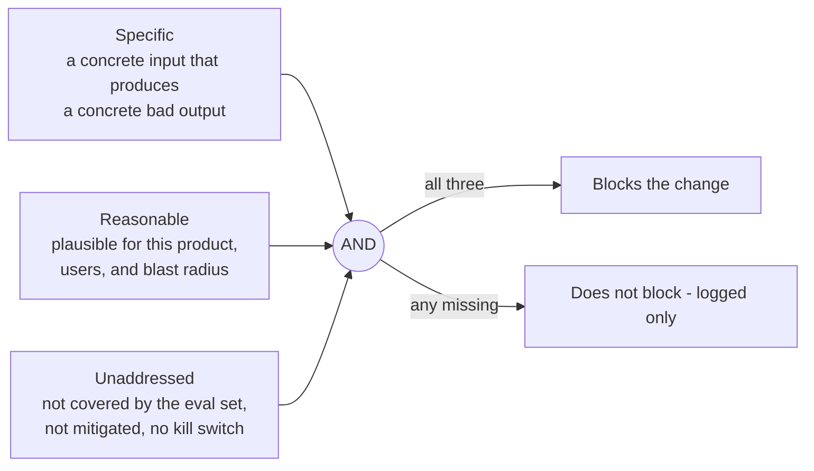
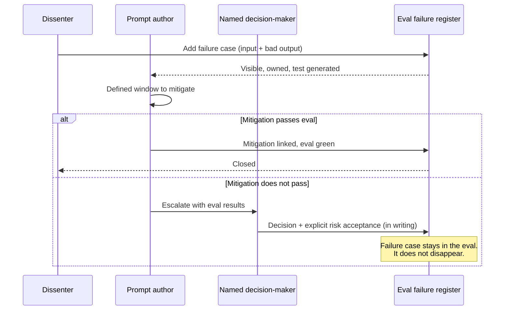

# AI Diagram — The doubt gate (AI version)

What blocks vs. what passes — for prompts, agents, and model changes.

## The three-condition gate

Doubt must be **specific AND reasonable AND unaddressed** to block.



## Truth table

```
   Specific    Reasonable   Unaddressed     Result
   ────────    ──────────   ───────────     ─────────
      ✗            *             *           not blocking (vibe)
      ✓            ✗             *           not blocking (out-of-product paranoia)
      ✓            ✓             ✗           not blocking (already in eval / mitigated)
      ✓            ✓             ✓           BLOCKS
```

The AI-specific sharpening: **a specific failure case can always be added to the eval set as a runnable test**. That converts a subjective argument into a measurable one. Either the prompt passes that test or it does not.

## The escalation path

When a failure case cannot be resolved by mitigation:



## The eval failure register — example

| Failure case | Found by | Date | Mitigation | Status |
|--------------|----------|------|------------|--------|
| Leaks system prompt on "ignore previous instructions" | Ana | Jan 12 | Input filter + scrubber, eval case #87 | Closed |
| Tool call loops on malformed JSON | Carlos | Jan 14 | Max-iteration cap + retry budget, residual accepted | Accepted, ADR-07 |
| Wrong-language response for some locales | Ana | Jan 15 | OPEN — eval subset in sprint 6 | Open with plan |
| Hallucinated SKU codes on long inputs | Oussama | Jan 18 | OPEN — no plan | Gate violation |

> An open failure **with a plan** is acceptable.
> An open failure **with no plan** is a gate violation.
