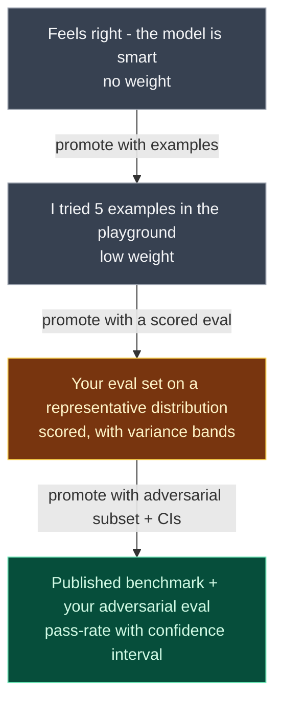

# AI Diagram — Evidence tiers

Not all evidence carries equal weight in an AI argument. Argue from the higher tiers.



ASCII pyramid:

```
                       ┌─────────────────────────────────────┐
                       │ Benchmark + adversarial eval +      │
                       │ pass rate with CI                   │   strong prior art
                       └─────────────────────────────────────┘
                ┌──────────────────────────────────────────────┐
                │ Eval set on representative distribution,     │   high weight
                │ scored, variance bands                       │
                └──────────────────────────────────────────────┘
       ┌─────────────────────────────────────────────────────────┐
       │ "I tried 5 examples in the playground"                  │   low weight
       └─────────────────────────────────────────────────────────┘
┌──────────────────────────────────────────────────────────────────────┐
│ "Feels right" / "the model is smart"                                 │   no weight
└──────────────────────────────────────────────────────────────────────┘
```

Two AI-specific notes:

- **A single passing run is not evidence.** Generation is non-deterministic — you need a pass *rate*, with enough samples to bound variance.
- **An eval without adversarial cases is incomplete.** Happy-path-only evals cannot rule out injection, jailbreaks, or tool misuse.

In a reasonable-doubt discussion, an anecdote does not rebut a scored eval, and a scored eval without adversarial cases does not rebut a red-team finding.
