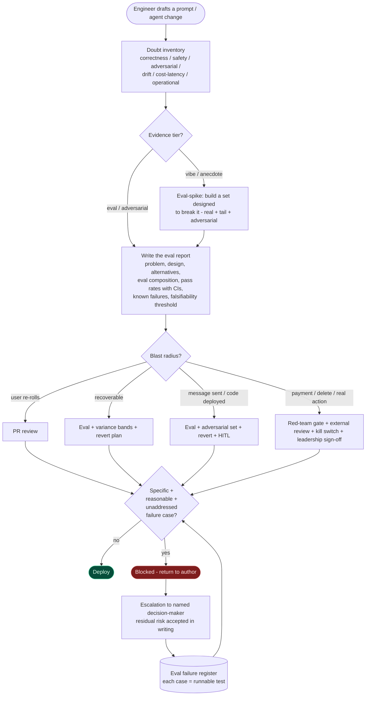

# AI Diagram — End-to-end prompt-to-deploy flow

How a prompt or agent change travels through the framework.

```mermaid
flowchart TD
    Idea([Engineer drafts a prompt / agent change])
    Inv[Doubt inventory<br/>correctness / safety / adversarial /<br/>drift / cost-latency / operational]
    Tier{Evidence tier?}
    Spike[Eval-spike: build a set designed<br/>to break it - real + tail + adversarial]
    Report[Write the eval report<br/>problem, design, alternatives,<br/>eval composition, pass rates with CIs,<br/>known failures, falsifiability threshold]
    Blast{Blast radius?}

    PR[PR review]
    Mid[Eval + variance bands + revert plan]
    High[Eval + adversarial set + revert + HITL]
    Max[Red-team gate + external review + kill switch + leadership sign-off]

    Gate{Specific +<br/>reasonable +<br/>unaddressed<br/>failure case?}
    Register[(Eval failure register<br/>each case = runnable test)]
    Ship([Deploy])
    Block([Blocked - return to author])
    Escalate[Escalation to named decision-maker<br/>residual risk accepted in writing]

    Idea --> Inv --> Tier
    Tier -- vibe / anecdote --> Spike
    Tier -- eval / adversarial --> Report
    Spike --> Report
    Report --> Blast
    Blast -- user re-rolls --> PR
    Blast -- recoverable --> Mid
    Blast -- message sent / code deployed --> High
    Blast -- payment / delete / real action --> Max
    PR --> Gate
    Mid --> Gate
    High --> Gate
    Max --> Gate

    Gate -- no --> Ship
    Gate -- yes --> Block
    Block --> Escalate
    Escalate --> Register
    Register --> Gate

    classDef good fill:#064e3b,stroke:#6ee7b7,color:#d1fae5;
    classDef bad fill:#7f1d1d,stroke:#fecaca,color:#fee2e2;
    class Ship good;
    class Block bad;
```
