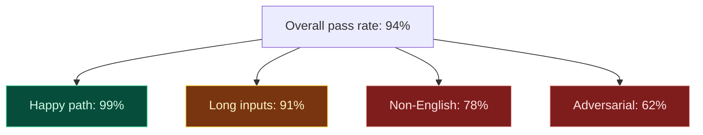

# AI Diagram — Variance and pass-rate thresholds

The deepest difference between AI work and normal software: **a single passing run is not evidence**. Generation is non-deterministic. A claim like *"this prompt works"* has to become *"this prompt passes at rate p with confidence interval [a, b] on n samples"* before it can be argued about.

---

## Pass rate is a distribution, not a boolean

```
   Pass rate
   1.00 ─────────────────────────────────────────
        │                              ┌────────┐
   0.96 │                              │  ████  │   prompt A
        │                              │ ██████ │   95% CI [0.93, 0.98]
   0.92 │                              │  ████  │
        │                              └────────┘
   0.88 │       ┌────────┐
        │       │  ████  │   prompt B
   0.84 │       │ ██████ │   95% CI [0.80, 0.91]
        │       │  ████  │
   0.80 │       └────────┘
        └─────────────────────────────────────────►
                  prompt B            prompt A
```

The point: prompt A has a higher *mean* pass rate, but the confidence intervals tell you whether the difference is real or noise. A vibe-based comparison ("A felt better in the playground") cannot make that call.

---

## Variance bands across slices

A single overall pass rate hides catastrophic failure on subsets. Slice by what actually matters.



> A 94% overall pass rate that hides a 62% adversarial pass rate is not a 94% prompt. It is a prompt with a known security weakness.

---

## The variance-threshold rule

Three concrete moves:

1. **Always report a pass rate, never a single example.** *"Works in the playground"* is not admissible.
2. **Always report sample size + confidence interval.** *"96%"* without `n` and CI is theatre.
3. **Always slice by what matters.** Language, length, adversarial subset, user tier — whatever the product cares about.

```
Acceptable claim:
   "Prompt v3 passes at 96% on the v2 eval set (n=400,
    95% CI [0.94, 0.98]). Adversarial subset: 84%
    (n=80, [0.75, 0.91]). No catastrophic failures."

Not acceptable:
   "Prompt v3 is better."
   "I tried it and it worked."
   "96%."
```

---

## Why this matters for the gate

A prompt that "usually works" cannot block a prompt that "passes at 96% with no catastrophic failures" — but it also can't *be blocked* by hand-waving doubt. The doubt has to take the form of *a specific failing case that can be added to the eval set*. Either the new prompt passes that case, or it doesn't. That is the entire point of running this discipline as evidence-driven, not preference-driven.
