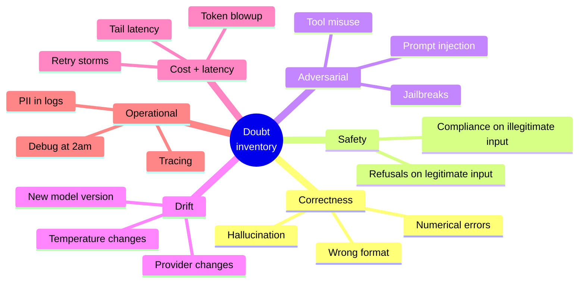
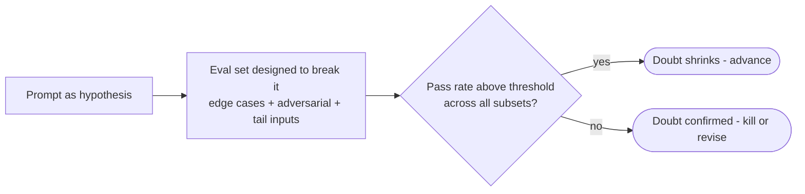

# AI Principle 1 — Guilty Until Proven Reliable

> **Core idea:** Every prompt, agent, or model change starts as suspect. It earns trust through evals, not enthusiasm.

The default in most teams is that a new prompt *will* work because the author tried it three times in a playground and it looked good. The reasonable-doubt approach inverts that: every prompt starts guilty. The burden is on the **eval evidence** to acquit it.

---

## The doubt inventory for AI

Before any prompt or agent discussion, list explicitly what could go wrong across six dimensions:



ASCII view:

```
                ┌─────────────────┐
                │ DOUBT INVENTORY │
                └────────┬────────┘
   ┌────────────┬────────┼─────────────┬────────────┬──────────┐
   ▼            ▼        ▼             ▼            ▼          ▼
Correctness  Safety  Adversarial    Drift    Cost+latency  Operational
```

The middle column — **Adversarial** — is the one most teams skip. It is the column that catches injection, jailbreaks, and tool misuse. Skipping it is not "moving fast," it's shipping a known unknown.

---

## Evidence tiers (AI version)

Not all evidence is equal. Argue from the higher tiers.

```
strength
   ▲
   │   ████████  Published benchmark + your adversarial eval, pass-rate
   │            with confidence interval
   │   ██████    Your eval set on a representative distribution
   │   ███       "I ran it on 5 examples in the playground"
   │   ·         "It feels right" / "the model is smart"
   └────────────────────────────────────────────────────────────► weight
```

| Tier | Example | Weight |
|------|---------|--------|
| Vibe | "Feels right, model is smart" | None |
| Anecdote | "I tried 3 examples in playground" | Low |
| Eval set on representative data | 200 real prompts, scored | High |
| Eval + adversarial set + variance bands | Real + red-team + confidence interval | Strong prior art |

Two AI-specific notes:

- **A single passing run is not evidence**, because generation is non-deterministic. You need a pass *rate*, not a pass.
- **An eval without an adversarial component is incomplete.** If the eval has only happy paths, it cannot rule out prompt injection.

---

## The eval-spike

Run a time-boxed evaluation specifically designed to **break** the prompt — not to validate it. The goal is to make it fail.



A useful framing for the eval-spike: **what is the smallest change to the input that would make this prompt fail catastrophically?** If you can't articulate the answer, you haven't run a real spike — you've run a sanity check.

---

## Tension to watch

Doubt must be *reasonable*. "What if the user asks the model to solve the Riemann hypothesis?" is not reasonable doubt for most products. The standard is: **would a careful prompt engineer consider this a real risk for this product, with this user base, at this blast radius?**

That standard is the subject of [Principle 2](./02-reasonable-practitioner-standard.md).
