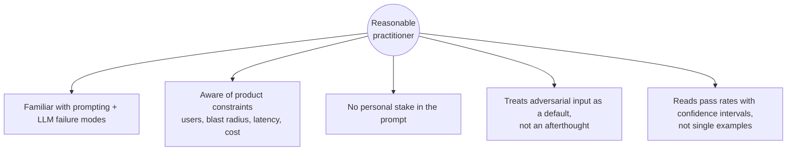
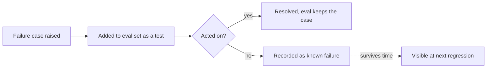

# AI Principle 2 — The Reasonable Practitioner Standard

> **Core idea:** Would a careful prompt engineer, given the same product context and the same eval results, accept this prompt or agent without further evidence?

AI discussions fail in two ways: the **authority trap** ("the senior ML person says we should use chain-of-thought, so we will") and the **preference trap** ("I just like how this prompt reads"). The reasonable practitioner standard cuts through both by elevating judgment to a shared, external reference point.

---

## What "reasonable practitioner" assumes



ASCII view:

```
                  ┌───────────────────────────┐
                  │ Reasonable practitioner   │
                  └─────────────┬─────────────┘
       ┌──────────────┬─────────┴────────┬────────────────┐
       ▼              ▼                  ▼                ▼
   prompting +    product            no personal    adversarial
   LLM failure    constraints        stake          by default
   modes
                                 ┌────────────────┐
                                 │ reads variance │
                                 │ + intervals,   │
                                 │ not anecdotes  │
                                 └────────────────┘
```

> Context is load-bearing. The reasonable practitioner shipping a chatbot toy and the reasonable practitioner shipping an agent with payment authority are not the same standard.

---

## Operationalizing the standard

Three concrete moves:

1. **The cold-read test** — would a careful prompt engineer who has never seen this product accept this prompt + eval report as ready to ship?
2. **The written eval rule** — the prompt's evaluation must be writable. "We tested it" is not evaluation. "Pass rate 96% on n=200 real inputs, 88% on the adversarial subset, 0 catastrophic failures" is.
3. **Dissent as a first-class artifact** — if someone raises a failure case, it is added to the eval set. Even if the team decides to ship anyway, the failure stays in the eval, and the next prompt change is measured against it.



The point of #3 is durability. A failure case that gets verbally waved off vanishes the moment the conversation ends. A failure case in the eval set ages, survives team changes, and gets caught the next time someone "improves" the prompt.

---

## Tension to watch

"Any reasonable practitioner would accept this" is a rhetorical move, not an argument. Invoking the standard requires **showing the eval set + the pass rates + the adversarial subset** — not just claiming the conclusion.

That demand — show the evidence — is what [Principle 3](./03-burden-of-proof.md) makes structural.
