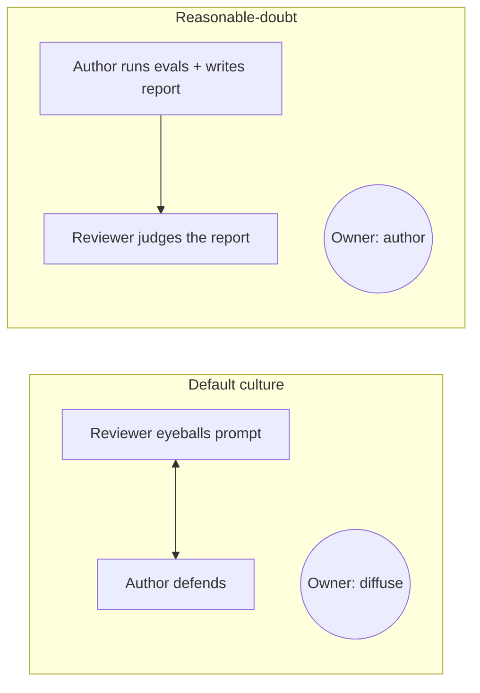
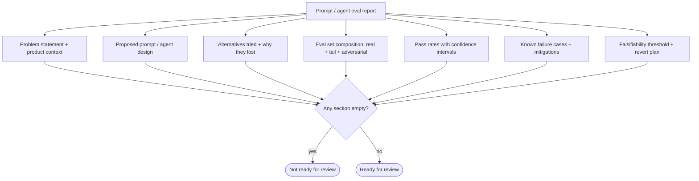

# AI Principle 3 — Burden of Proof on the Author

> **Core idea:** Whoever ships the prompt or agent carries the full burden of eliminating reasonable doubt. Reviewers judge the eval report; they do not run the evals for the author.

In most teams, the burden is diffuse. The author tries the prompt, the team "looks at it," nobody owns the outcome. The reasonable-doubt approach assigns the burden entirely to the author.

---

## Default vs. reasonable-doubt



ASCII view:

```
Default culture                  Reasonable-doubt
────────────────                 ──────────────────
 reviewer ⇄ author                author ──► reviewer
   (joint eyeball)                 (author runs evals,
                                    reviewer judges)
 owner: diffuse                   owner: author
```

---

## What a complete proposal looks like

Before review, the author should have addressed:

- The most obvious failure modes, with mitigations
- At least one meaningful alternative prompt or model, and why it lost
- The adversarial subset of the eval, with pass rate
- A **falsifiability threshold** — under what measured condition would the team revert this?
- What is *not* covered by the eval, and the plan to cover it

---

## The falsifiability test (AI version)

A good prompt/agent proposal should answer: **under what measured condition would we know this was the wrong call?**

```
+---------------------------------------------------------------+
| Falsifiable claim                                             |
+---------------------------------------------------------------+
| "If pass rate drops below 92% on the v3 eval set after a      |
|  model version change, this prompt is reverted."              |
+---------------------------------------------------------------+
| "If any prompt-injection case in the red-team set succeeds,   |
|  the agent loses tool access until mitigated."                |
+---------------------------------------------------------------+
| "If user-reported hallucination rate exceeds 1% over a        |
|  7-day window, this prompt is rolled back."                   |
+---------------------------------------------------------------+
```

If the author cannot state a measurable revert condition, the prompt is not ready for review.

---

## The eval report as a legal brief



An eval report with no adversarial subset, no confidence intervals, or no revert plan is not ready for review.

---

## Tension to watch

This principle can silence engineers new to prompting if they don't have access to eval tooling. The bar stays high, but the team **provides** the tooling — shared eval harnesses, red-team libraries, prompt-injection corpora — so the bar is reachable, not just demanded.

The bar gets sharper still when the AI action is hard to undo. That's [Principle 4](./04-blast-radius.md).
