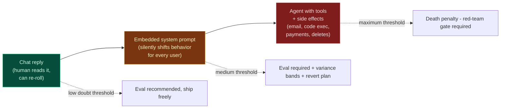
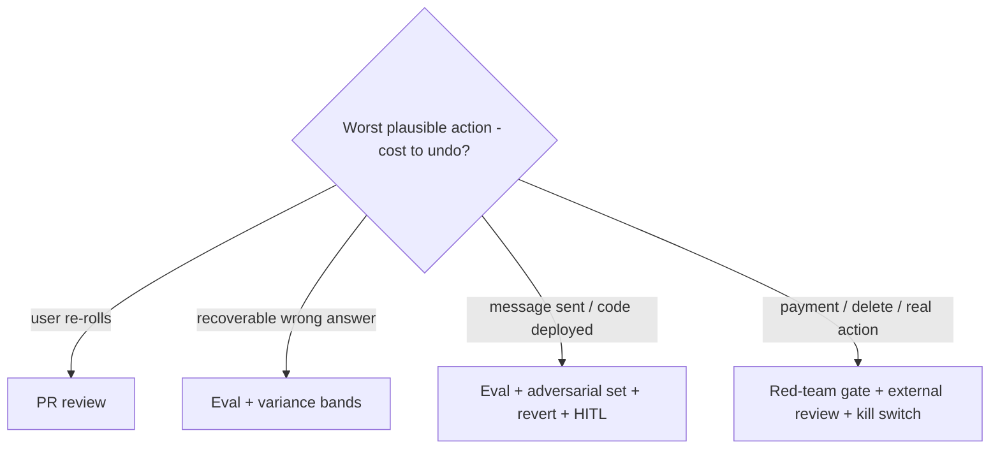
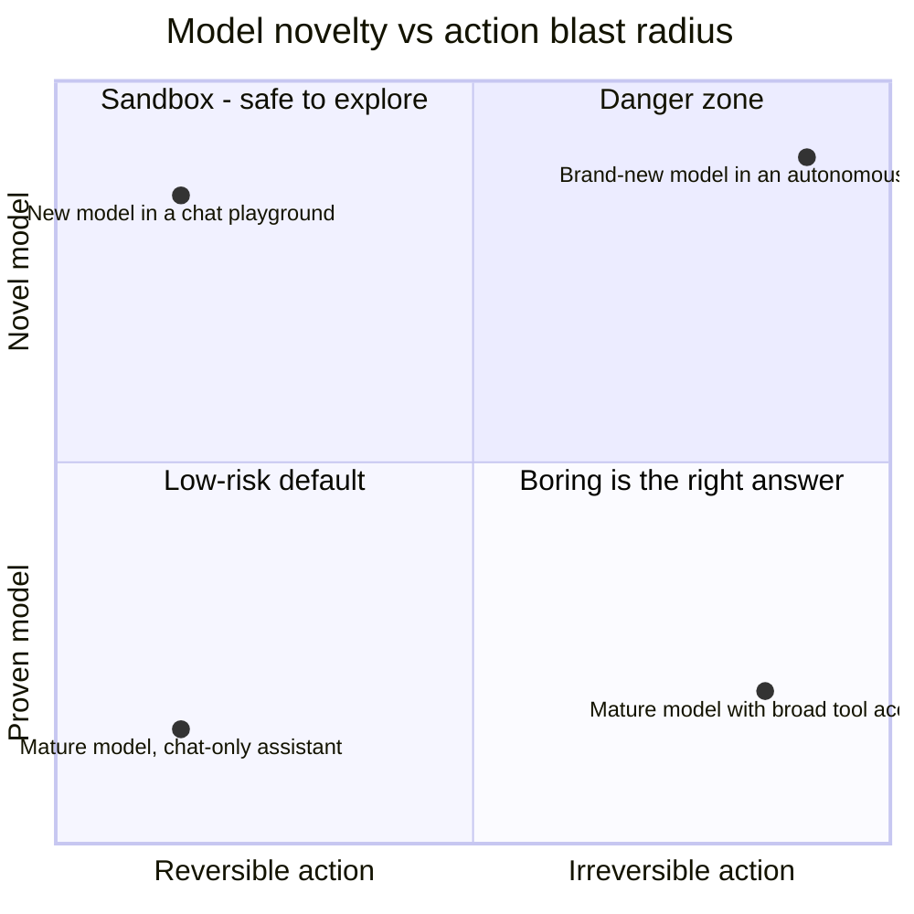

# AI Principle 4 — Blast Radius as the Death Penalty

> **Core idea:** The certainty required before shipping an AI behavior should scale with the **autonomy of the AI** and the **side effects of its actions** — not with the size of the prompt change.

In normal software, the "irreversibility" of a decision drives the threshold. In AI, the same idea takes a sharper form: a single token of output can trigger an irreversible action if the model has tools, money, or write access.

A 5-line prompt change that adds an `execute_payment` tool to an agent is a bigger decision than a 500-line refactor of the eval harness.

---

## The blast-radius spectrum



ASCII version:

```
   ◄──── low blast radius                    high blast radius ────►
   ┌───────────────┬─────────────────────┬───────────────────────┐
   │  CHAT REPLY   │  SYSTEM PROMPT      │   AGENT + TOOLS       │
   │  (one-shot)   │  IN PRODUCT         │   + SIDE EFFECTS      │
   ├───────────────┼─────────────────────┼───────────────────────┤
   │ human reads   │ silent behavior     │ sends email, runs     │
   │ + re-rolls    │ shift across all    │ code, moves money,    │
   │               │ users               │ deletes data          │
   ├───────────────┼─────────────────────┼───────────────────────┤
   │ low doubt     │ medium doubt        │ MAXIMUM doubt         │
   │ threshold     │ threshold           │ threshold             │
   │               │                     │                       │
   │ eval recommend│ eval + variance     │ red-team gate +       │
   │               │ + revert plan       │ external review +     │
   │               │                     │ kill switch + audit   │
   └───────────────┴─────────────────────┴───────────────────────┘
```

---

## The blast-radius gate

Before any significant AI change, ask: **if this AI takes the worst plausible action one time, what does it cost to undo?**

| Cost to undo (worst plausible action) | Doubt threshold | Process required |
|---------------------------------------|-----------------|------------------|
| User just regenerates | Low | PR review |
| Wrong answer for a user, recoverable | Medium | Eval set + variance bands |
| Email/message/post already sent, code deployed | High | Eval + adversarial set + revert plan + human-in-the-loop |
| Payment moved, data deleted, real-world action taken | Maximum | Red-team gate + external review + kill switch + audit log + leadership sign-off |



---

## Designing for reversibility (AI version)

Some properties shrink blast radius and should be designed in by default:

- **Human-in-the-loop for irreversible actions.** The model proposes; the human commits.
- **Idempotent, dry-run-able tools.** Tools that can be safely re-run, and that have a dry-run mode.
- **Per-tool authorization.** Just because the model can write to a database does not mean it can `DROP TABLE`.
- **Audit log of every action.** Not just the prompt and response — every tool call, every argument, every side effect.
- **Kill switch.** A single config flag that takes the agent fully offline without redeploy.
- **Prefer proven models for irreversible action paths.** Novelty and irreversibility are the danger zone.



---

## Tension to watch

Taken too far, this principle blocks every interesting AI feature behind a wall of red-team review. The classification of blast radius must be done honestly — and revisited as the product changes. A chat assistant that "could one day" gain tool access should be evaluated for what it *is*, not for every possible future.

The mechanism that actually enforces all four prior principles is [Principle 5 — the gate](./05-doubt-gate.md).
