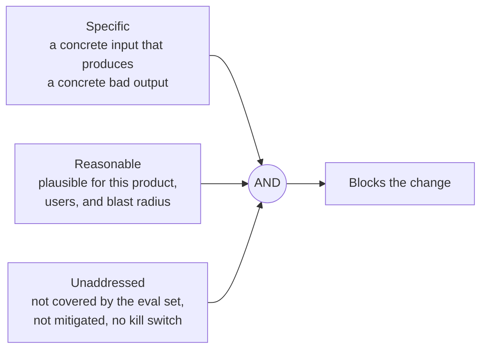
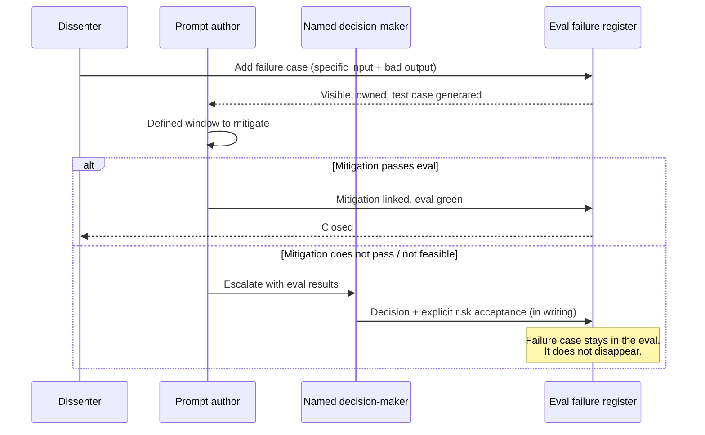
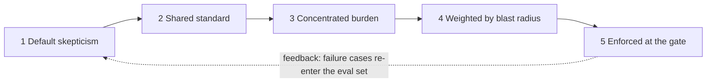

# AI Principle 5 — Reasonable Doubt as a Deploy Gate

> **Core idea:** If anyone on the team can articulate a specific, reasonable, unaddressed failure case — the prompt or agent does not ship.

The previous four principles govern *evaluation*. This one governs *process*. It asks: what if a known failing eval case had formal blocking power?

---

## What qualifies as blocking doubt (AI version)

Doubt must be **all three** to block:



ASCII truth table:

```
   Specific    Reasonable   Unaddressed     Result
   ────────    ──────────   ───────────     ─────────
      ✗            *             *           not blocking (vibe)
      ✓            ✗             *           not blocking (out-of-product paranoia)
      ✓            ✓             ✗           not blocking (already in eval / mitigated)
      ✓            ✓             ✓           BLOCKS
```

For AI, the bar is sharper than in normal software: **a specific failure case can be added to the eval set as a test.** Once it's a test, "unaddressed" becomes a measurable thing — does the prompt pass that test or not?

---

## The eval failure register

A living document attached to significant AI deployments. Every failure case found, its mitigation status, and who owns it.

| Failure case | Found by | Date | Mitigation | Status |
|--------------|----------|------|------------|--------|
| Model leaks system prompt on "ignore previous instructions" | Ana | Jan 12 | Added input filter + system-prompt scrubber, eval case #87 added | Closed |
| Tool call repeats infinitely on malformed JSON | Carlos | Jan 14 | Added max-iteration cap + retry budget, accepted residual risk | Accepted, ADR-07 |
| Agent answers in wrong language for some locales | Ana | Jan 15 | OPEN — eval subset being built for sprint 6 | Open with plan |
| Hallucinated SKU codes on long inputs | Oussama | Jan 18 | OPEN — no plan yet | Gate violation |

> An open failure **with a plan** is acceptable.
> An open failure **with no plan** is a gate violation.

The eval-set version of the register is more useful than the doc-only version: every entry becomes a runnable test that the next prompt change must pass.

---

## The escalation path

When a failure case cannot be resolved by mitigation:



When the decision-maker overrides a failure, they **accept the residual risk in writing**, and the failing eval case stays in the suite. The next prompt change either fixes it or has to re-accept the risk explicitly.

---

## Tension to watch

This principle has the highest misuse potential. It can become a weapon for obstruction — every "what about this rare jailbreak?" used to block legitimate work.

The antidote: **the definition of "reasonable" must be tied to the product's actual users, distribution, and blast radius**. A jailbreak that produces a rude joke in a creative-writing toy is not the same as one that exfiltrates private data from an agent. The gate works only if "reasonable" is shared, written down, and enforced consistently.

---

## How the five principles close the loop



The gate is the enforcement layer. Without it, the first four principles are aspirational. Without the first four, the gate is bureaucracy.
