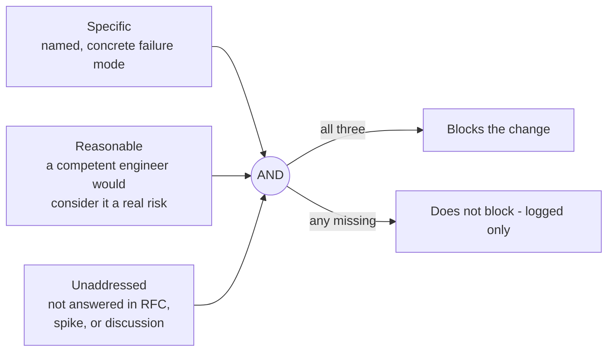
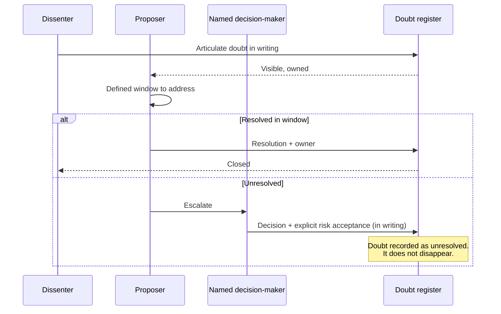

# Diagram — The doubt gate

What blocks vs. what passes.

## The three-condition gate

Doubt must be **specific AND reasonable AND unaddressed** to block.



## Truth table

```
   Specific    Reasonable   Unaddressed     Result
   ────────    ──────────   ───────────     ─────────
      ✗            *             *           not blocking (vibe)
      ✓            ✗             *           not blocking (paranoia)
      ✓            ✓             ✗           not blocking (already addressed)
      ✓            ✓             ✓           BLOCKS
```

## The escalation path

When doubt cannot be resolved by discussion:



## The doubt register — example

| Doubt raised | Raised by | Date | Resolution | Resolved by |
|--------------|-----------|------|------------|-------------|
| No circuit breaker on downstream calls | Ana | Jan 12 | Added Polly retry + circuit breaker, PR #412 | Oussama |
| Redis single point of failure | Carlos | Jan 14 | Accepted risk — revisit at 50k users, ADR-07 | Team |
| Schema migration plan for v2 unclear | Ana | Jan 15 | OPEN — spike scheduled for sprint 6 | Oussama |

> An open doubt **with a plan** is acceptable.
> An open doubt **with no plan** is a gate violation.
