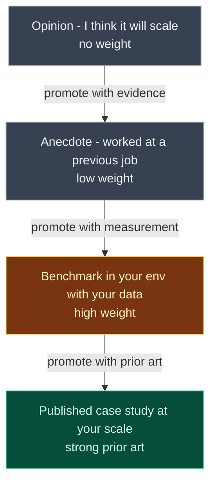

# Diagram — Evidence tiers

Not all evidence carries equal weight in an architecture argument. Argue from the higher tiers.



ASCII pyramid:

```
                       ┌─────────────────────────────┐
                       │ Published case study at     │
                       │ your scale                  │   strong prior art
                       └─────────────────────────────┘
                ┌──────────────────────────────────────────┐
                │ Benchmark in your environment, your data │   high weight
                └──────────────────────────────────────────┘
       ┌─────────────────────────────────────────────────────────┐
       │ Anecdote - worked at a previous job                      │   low weight
       └─────────────────────────────────────────────────────────┘
┌──────────────────────────────────────────────────────────────────────┐
│ Opinion - "I think it will scale"                                    │   no weight
└──────────────────────────────────────────────────────────────────────┘
```

The asymmetry matters: in a Verdict-style discussion, an opinion does not rebut a benchmark. A benchmark does not require an opinion to overturn it — it requires another benchmark or stronger.
