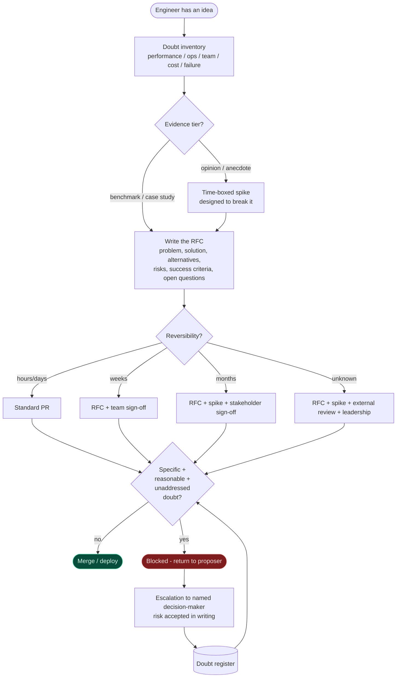

# Diagram — End-to-end decision flow

How a proposal travels through the framework.

```mermaid
flowchart TD
    Idea([Engineer has an idea])
    Inv[Doubt inventory<br/>performance / ops / team / cost / failure]
    Tier{Evidence tier?}
    Spike[Time-boxed spike<br/>designed to break it]
    RFC[Write the RFC<br/>problem, solution, alternatives,<br/>risks, success criteria, open questions]
    Rev{Reversibility?}

    PR[Standard PR]
    RFCSign[RFC + team sign-off]
    StakeSign[RFC + spike + stakeholder sign-off]
    LeadSign[RFC + spike + external review + leadership]

    Gate{Specific +<br/>reasonable +<br/>unaddressed<br/>doubt?}
    Register[(Doubt register)]
    Merge([Merge / deploy])
    Block([Blocked - return to proposer])
    Escalate[Escalation to named decision-maker<br/>risk accepted in writing]

    Idea --> Inv --> Tier
    Tier -- opinion / anecdote --> Spike
    Tier -- benchmark / case study --> RFC
    Spike --> RFC
    RFC --> Rev
    Rev -- hours/days --> PR
    Rev -- weeks --> RFCSign
    Rev -- months --> StakeSign
    Rev -- unknown --> LeadSign
    PR --> Gate
    RFCSign --> Gate
    StakeSign --> Gate
    LeadSign --> Gate

    Gate -- no --> Merge
    Gate -- yes --> Block
    Block --> Escalate
    Escalate --> Register
    Register --> Gate

    classDef good fill:#064e3b,stroke:#6ee7b7,color:#d1fae5;
    classDef bad fill:#7f1d1d,stroke:#fecaca,color:#fee2e2;
    class Merge good;
    class Block bad;
```
