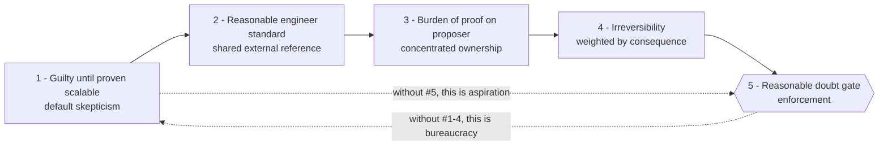

# Diagram — How the five principles interlock

The principles are not independent. Each one supports the next, and the gate (#5) is only meaningful if all four prior principles are in place.



ASCII map of dependencies:

```
   P1 ──► P2 ──► P3 ──► P4 ──► P5
   │                              │
   │   gate requires the rest     │
   ◄──────────────────────────────┘
        principles need the gate
```

What each principle protects against:

```
+-------+--------------------------------------+----------------------------+
|   #   | Principle                            | Failure mode it kills      |
+-------+--------------------------------------+----------------------------+
|   1   | Guilty until proven scalable         | Optimism bias              |
|   2   | Reasonable engineer standard         | Authority + preference bias|
|   3   | Burden of proof on proposer          | Diffuse accountability     |
|   4   | Irreversibility as death penalty     | Underestimating consequence|
|   5   | Reasonable doubt gate                | Doubt raised but ignored   |
+-------+--------------------------------------+----------------------------+
```
