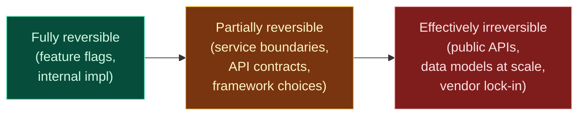
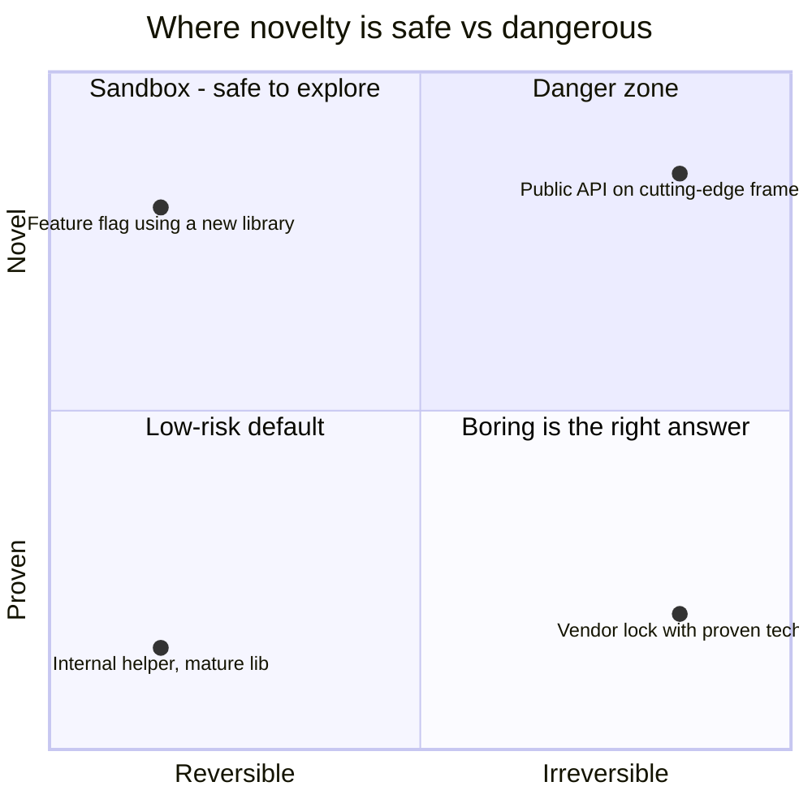

# Diagram — Reversibility spectrum

The death-penalty axis. Doubt threshold scales with how hard a decision is to undo.



ASCII version with thresholds:

```
   ◄──── easier to undo                       harder to undo ────►
   ┌──────────────┬────────────────────┬──────────────────────┐
   │   FULLY      │     PARTIALLY      │     EFFECTIVELY      │
   │  reversible  │     reversible     │     irreversible     │
   ├──────────────┼────────────────────┼──────────────────────┤
   │ feature flag │ service boundary   │ public API           │
   │ internal impl│ API contract       │ data model at scale  │
   │ helper code  │ framework choice   │ vendor lock-in       │
   ├──────────────┼────────────────────┼──────────────────────┤
   │ low doubt    │ medium doubt       │ MAXIMUM doubt        │
   │ threshold    │ threshold          │ threshold            │
   │              │                    │                      │
   │ standard PR  │ RFC + sign-off     │ RFC + spike +        │
   │              │ + checkpoint       │ external review +    │
   │              │                    │ leadership sign-off  │
   └──────────────┴────────────────────┴──────────────────────┘
```

The 12-month question: **what would it cost to undo this in 12 months?**

| Cost to undo | Threshold | Process |
|--------------|-----------|---------|
| Hours to days | Low | Standard PR review |
| Weeks | Medium | RFC + team sign-off |
| Months | High | RFC + spike + stakeholder sign-off |
| Unknown / existential | Maximum | RFC + spike + external review + leadership sign-off |

---

## Novelty × Reversibility

Novelty is fine in reversible places. Novelty in irreversible places is the danger zone.


