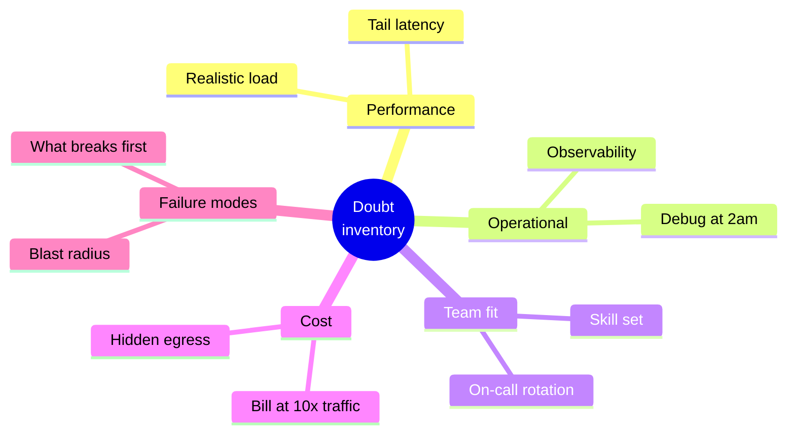
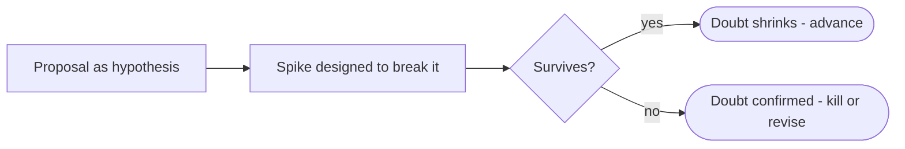

# Principle 1 — Guilty Until Proven Scalable

> **Core idea:** Every architecture decision starts as suspect. It earns trust through evidence, not enthusiasm.

The default in most teams is that a new proposal *will* work. The Verdict Framework inverts that: every proposal starts guilty. The burden is on the evidence to acquit it.

---

## The doubt inventory

Before any architecture discussion, list explicitly what could go wrong across five dimensions:



ASCII view for plain-text contexts:

```
                ┌─────────────────┐
                │ DOUBT INVENTORY │
                └────────┬────────┘
        ┌──────────┬─────┴─────┬──────────┬──────────┐
        ▼          ▼           ▼          ▼          ▼
   Performance  Operational  Team fit   Cost     Failure
                                                  modes
```

---

## Evidence tiers

Not all evidence carries equal weight. Argue with the higher tiers.

```
strength
   ▲
   │   ████████  Published case study at your scale
   │   ██████    Benchmark in your env with your data
   │   ███       Anecdote (worked at a previous job)
   │   ·         Opinion ("I think it will scale")
   └────────────────────────────────────────────► weight
```

| Tier | Example | Weight |
|------|---------|--------|
| Opinion | "I think this will scale" | None |
| Anecdote | "We used this at my last job" | Low |
| Benchmark in your env with your data | Load test against real traffic shape | High |
| Published case study at your scale | A well-documented postmortem from a peer org | Strong prior art |

---

## The spike as investigation

Run a time-boxed spike specifically designed to **attack** the proposal — not validate it. The goal is to make it fail. If it survives, doubt shrinks.



---

## Tension to watch

Doubt must be *reasonable*. "What if our servers get hit by a meteor?" is not reasonable doubt. The standard is: **would a competent, informed engineer consider this a real risk given our context?**

That standard is the subject of [Principle 2](./02-reasonable-engineer-standard.md).
