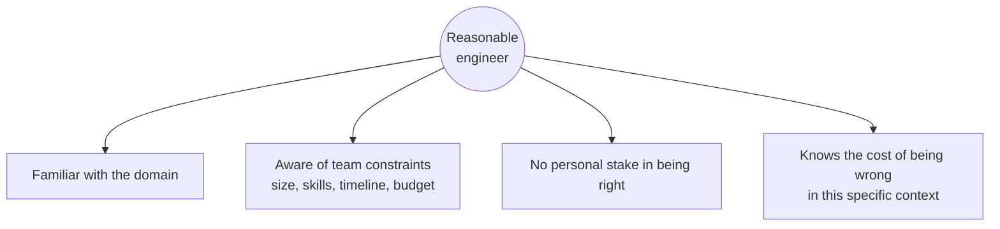

# Principle 2 — The Reasonable Engineer Standard

> **Core idea:** Would a reasonable senior engineer, given the same context and constraints, have significant doubts about this decision?

Architecture discussions fail in two ways: the **authority trap** (the most senior voice wins) and the **preference trap** ("I don't like this" wearing the costume of a technical concern). The reasonable engineer standard cuts through both by elevating judgment to a shared, external reference point.

---

## What "reasonable" assumes



ASCII view:

```
                  ┌───────────────────────┐
                  │ Reasonable engineer   │
                  └───────────┬───────────┘
       ┌──────────────┬───────┴───────┬──────────────┐
       ▼              ▼               ▼              ▼
   domain        team           no personal      knows cost
   familiar    constraints       stake           of being
                                                  wrong
```

> Context is load-bearing. The reasonable engineer at a 5-person startup and the reasonable engineer at a 500-person company are not the same standard.

---

## Operationalizing the standard

Three concrete moves:

1. **The phone-a-friend test** — would a respected engineer *outside* our team raise an eyebrow at this decision?
2. **The written justification rule** — architecture decisions must be written as if explaining to someone who was not in the room. Vague reasoning collapses under this pressure.
3. **Dissent as a first-class artifact** — if someone raises a concern, it is documented. Even if overruled, the doubt is on the record.


The point of #3 is durability. A concern that gets verbally waved off vanishes. A concern that's written down can age, ripen, and be re-litigated when reality breaks the way the dissenter feared.

---

## Tension to watch

"Any reasonable engineer would agree with me" is a rhetorical move, not an argument. Invoking the standard requires **showing your reasoning**, not just claiming the conclusion.

That demand — show the reasoning — is what [Principle 3](./03-burden-of-proof.md) makes structural.
