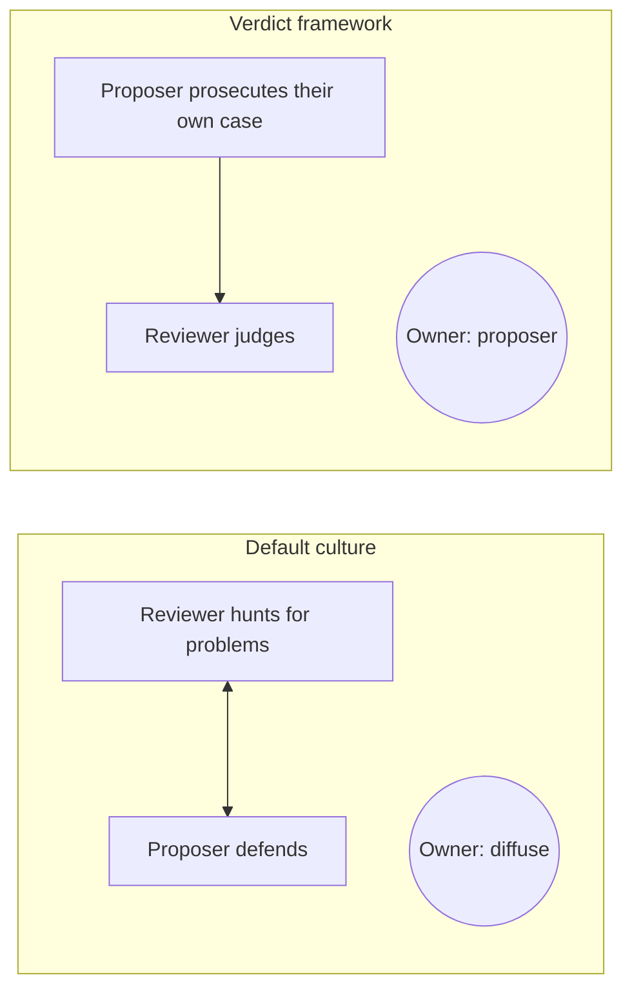
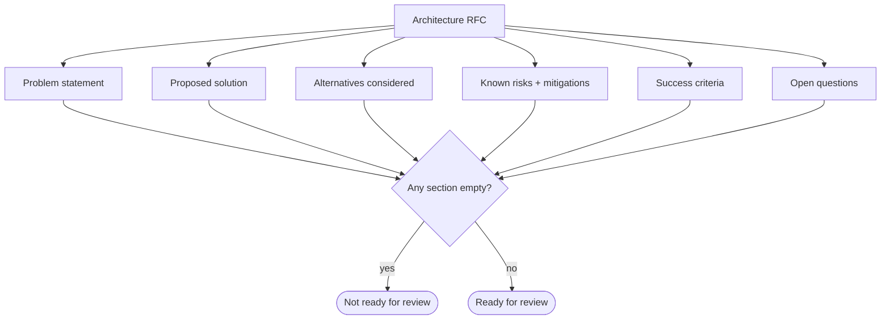

# Principle 3 — Burden of Proof on the Proposer

> **Core idea:** The proposer carries the full burden of eliminating reasonable doubt. Reviewers are judges, not investigators.

In most teams, doubt is shared — reviewers hunt for problems while proposers defend choices. This diffuses accountability and produces decisions nobody quite owns. The Verdict Framework assigns the burden entirely to the proposer.

---

## Default vs. Verdict



ASCII view:

```
Default culture                  Verdict framework
────────────────                 ──────────────────
 reviewer ⇄ proposer              proposer ──► reviewer
   (joint hunt)                    (proposer prosecutes,
                                    reviewer judges)
 owner: diffuse                   owner: proposer
```

---

## What a complete proposal looks like

Before review, the proposer should have addressed:

- The most obvious failure modes, with mitigations
- At least one meaningful alternative and why it was rejected
- What is not yet known, and the plan to find out
- What "this decision was wrong" would look like — the **falsifiability test**

---

## The falsifiability test

A good architecture proposal should answer: **under what conditions would we know this was the wrong call?**

```
+---------------------------------------------------------------+
| Falsifiable claim                                             |
+---------------------------------------------------------------+
| "If p99 latency exceeds 200ms under peak load,                |
|  this approach needs revisiting."                             |
+---------------------------------------------------------------+
| "If onboarding a new engineer takes more than two days,       |
|  the abstraction is too complex."                             |
+---------------------------------------------------------------+
| "If we need to change the data model within 6 months,         |
|  we chose the wrong storage engine."                          |
+---------------------------------------------------------------+
```

If the proposer cannot answer the falsifiability question, the proposal is not ready for review.

---

## The RFC as a legal brief



An RFC with empty sections is not ready for review.

---

## Tension to watch

This principle can silence junior engineers if not balanced with active support. The standard stays high, but the team helps junior engineers meet it — through pairing, templates, and explicit mentorship. The bar applies to the *proposal*, not to the person.

The bar gets sharper still when the decision is hard to reverse. That's [Principle 4](./04-irreversibility.md).
