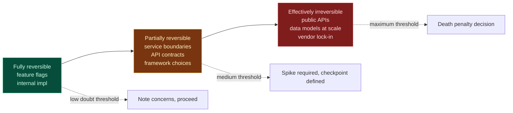
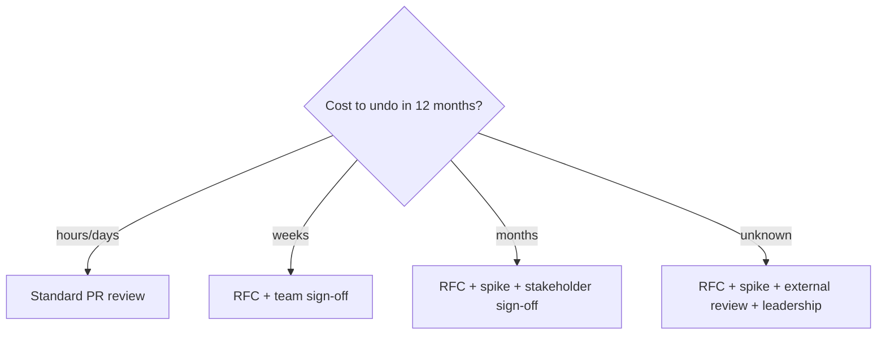
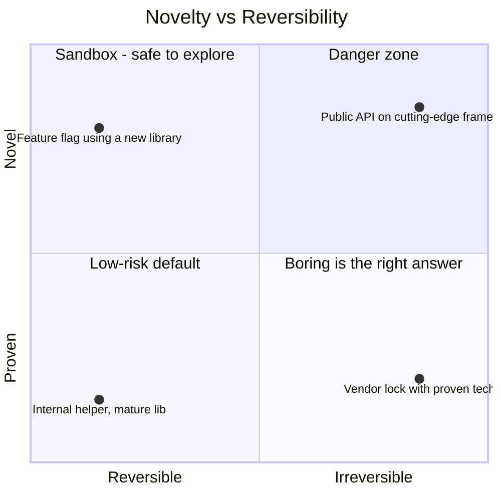

# Principle 4 — Irreversibility as the Death Penalty

> **Core idea:** The degree of certainty required before deciding should scale with how hard the decision is to undo.

In legal systems with capital punishment, the standard is theoretically higher because the consequence is irreversible. The same logic applies to architecture: the harder a decision is to reverse, the higher the doubt threshold before committing.

---

## The reversibility spectrum



ASCII view:

```
   reversibility
   ────────────────────────────────────────────────►
   ┌──────────────┬────────────────────┬──────────────┐
   │   FULLY      │     PARTIALLY      │  EFFECTIVELY │
   │  reversible  │     reversible     │ irreversible │
   ├──────────────┼────────────────────┼──────────────┤
   │ feature flag │ service boundary   │ public API   │
   │ internal impl│ API contract       │ data model   │
   │              │ framework choice   │ vendor lock  │
   └──────────────┴────────────────────┴──────────────┘
     low doubt        medium doubt        MAX doubt
     threshold         threshold          threshold
```

---

## The reversibility gate

Before any significant decision, ask: **what would it cost to undo this in 12 months?**

| Cost to undo (12 months) | Doubt threshold | Process required |
|--------------------------|-----------------|------------------|
| Hours to days | Low | Standard PR review |
| Weeks | Medium | RFC + team sign-off |
| Months | High | RFC + spike + stakeholder sign-off |
| Unknown / potentially existential | Maximum | RFC + spike + external review + leadership sign-off |



---

## Designing for reversibility

Reversibility is an architecture quality worth investing in:

- Wrap external dependencies behind interfaces
- Keep business logic out of the database
- Version APIs from day one, even internally
- Use the **strangler fig** pattern for migrations — never hard cutovers
- Prefer proven technology for irreversible choices

> **Novelty and irreversibility are a dangerous combination.**



---

## Tension to watch

Taken too far, this principle produces paralysis. Everything starts to feel irreversible. The classification must be done collaboratively and honestly — and not used strategically to avoid committing.

The mechanism that actually enforces all four prior principles is [Principle 5 — the gate](./05-doubt-gate.md).
