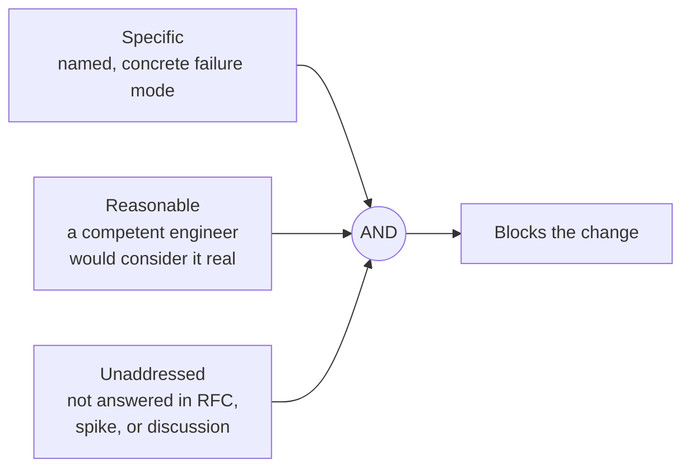
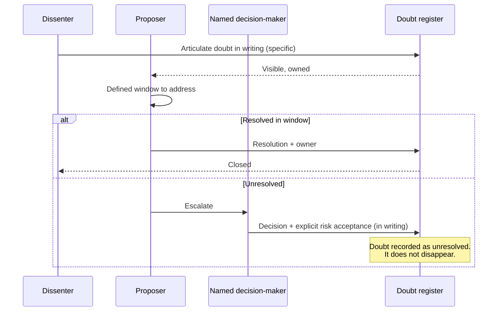
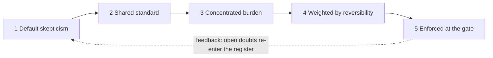

# Principle 5 — Reasonable Doubt as a Merge/Deploy Gate

> **Core idea:** If anyone on the team can articulate a specific, reasonable, unaddressed concern — the change does not go forward.

The previous four principles govern *thinking*. This one governs *process*. It asks: what if reasonable doubt had formal blocking power?

---

## What qualifies as blocking doubt

Doubt must be **all three** to block:



ASCII view (the truth table):

```
   Specific    Reasonable   Unaddressed     Result
   ────────    ──────────   ───────────     ─────────
      ✗            *             *           not blocking (vibe)
      ✓            ✗             *           not blocking (paranoia)
      ✓            ✓             ✗           not blocking (already addressed)
      ✓            ✓             ✓           BLOCKS
```

The absence of any one of the three means the concern is logged but does not block.

---

## The doubt register

A living document attached to significant architecture decisions. Every concern raised, its resolution, and who owns it.

| Doubt raised | Raised by | Date | Resolution | Resolved by |
|--------------|-----------|------|------------|-------------|
| No circuit breaker on downstream calls | Ana | Jan 12 | Added Polly retry + circuit breaker, PR #412 | Oussama |
| Redis single point of failure | Carlos | Jan 14 | Accepted risk — revisit at 50k users, ADR-07 | Team |
| Schema migration plan for v2 unclear | Ana | Jan 15 | OPEN — spike scheduled for sprint 6 | Oussama |

> An open doubt **with a plan** is acceptable.
> An open doubt **with no plan** is a gate violation.

---

## The escalation path

Pure unanimity breaks down in practice. When doubt cannot be resolved:



The key move at the end: when the decision-maker overrides a doubt, they **accept the risk in writing**. The doubt is recorded as unresolved in the register — it doesn't get erased by the decision.

---

## Tension to watch

This principle has the highest misuse potential. It can become a weapon for obstruction or a bureaucracy trap.

The antidote: the **definition of reasonable doubt must be shared, explicit, and consistently enforced** by the team. If "reasonable" is in the eye of the loudest, the gate breaks down.

---

## How the five principles close the loop



The gate is the enforcement layer. Without it, the first four principles are aspirational. Without the first four, the gate is bureaucracy.
